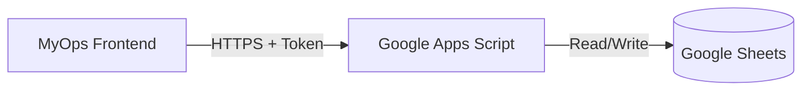

# MyOps

> **Status:** System v2.0
> **Architecture:** Serverless / Sovereign
> **Cost:** $0.00 / month

**MyOps** is a sovereign task execution system. It replaces complex project management SaaS with a lightweight, operator-grade interface backed by Google Sheets.

---

## System Architecture

---

## Deployment Protocol

### Phase 1: The Vault (Google Sheets)

1. Create a new **Google Sheet**.
2. Rename the sheet (tab) at the bottom to `tasks`. **(Case sensitive)**.
3. Create the following headers in **Row 1**:

| Col A | Col B | Col C | Col D | Col E | Col F | Col G |
|-------|-------|-------|-------|-------|-------|-------|
| date | description | project | priority | status | createdAt | id |

### Phase 2: The Gateway (Google Apps Script)

1. Inside your Google Sheet, go to **Extensions > Apps Script**.
2. Rename the project to `MyOps API`.
3. **Get the Code:**
   - Open the MyOps Web App (this repo running locally).
   - Click **Config** > **Backend Code**.
   - Copy the script.
4. Paste it into `Code.gs` in the Google Script editor.
5. **CRITICAL:** Change the `API_SECRET` variable at the top of the file to a strong password.
6. Click **Deploy > New Deployment**.
   - **Select type:** Web app.
   - **Description:** `v1`.
   - **Execute as:** `Me` (your email).
   - **Who has access:** `Anyone` (Security is handled by your API Token).
7. Copy the **Web App URL**.

### Phase 3: The Interface (Frontend)

1. Clone this repository.
2. Install dependencies: `npm install`
3. Start the local server: `npm start`
4. Click **Config** > **Live Mode**.
5. Paste your **Web App URL** and **API Secret Token**.
6. Save.

---

*"Own your ledger, own your life."*